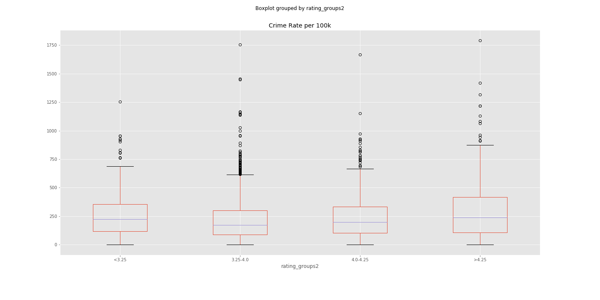
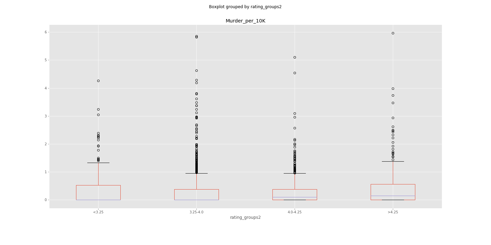
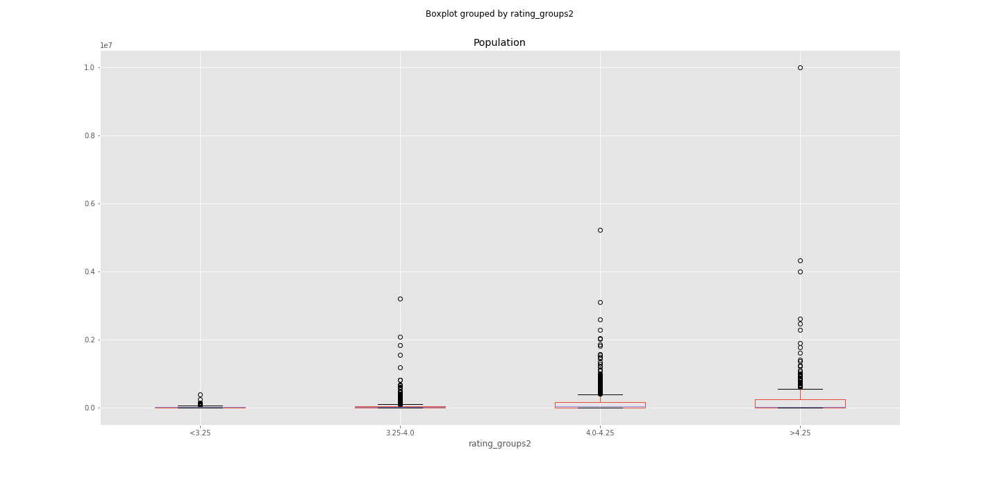

#ProjectPlan

## Project Title
* Crime and Dine

## Team Members
* Rachel Berkowitz, Jeanette Cross, Michael Lygas, Xeniya Bogoslavskaya

## Project Description/Outline
* Comparing the restaurant ratings to the US crime statistics and income.

## Research Description/Outline
* Look at the different rates for different crimes (murder, bugglery etc.) compared to the restaurant ratings and income.

## Research Question to Answer
* Does the number of high rated restaurants in a given area correlate to the  number of crimes in the area?
* How does it differ by different types of crimes?
* Will a dining establishment Yelp review be impacted by population metrics (ie a more populous area have a higher rating)?

## Data Sets to be Used
* Restaurant rating data (from csv by lat, long)
* Crime data from United States crime rates by county
* Income data from the census
* govt api that converts lat and long to county

## Rough Breakdown of Tasks
* Import and pull all data
* Transform it into datasets etc.
* Clean the data for errors
* Compile the data to be at the same level (county perhaps)
* Merge the three datasets together
* Graphing and mapping the dataset to answer our questions

## Hypothesis
* We expect there not to be a corrrelation between the restaurant ratings and the crime statistics because their are oftern good eateries in bad areas. We expect more expensive restaurants to get a higher rating but that income will not be correlated.

## Conclusions
* Does the number of high rated restaurants in a given area correlate to the  number of crimes in the area?
  * While there isn’t a linear correlation, using ANOVA we can see that the two are correlated.

* How does it differ by different types of crimes?
  * Different types of crimes (such as murder, MV theft, and larceny) are also not linearly correlated but using ANOVA we can see that different avg. ratings do correlate with different crime rates.

* Will a dining establishment Yelp review be impacted by population metrics (ie a more populous area have a higher rating)?
  * Population is correlated to the avg. rating but it may not be a linear correlation and there are many outliers. 

## Final Thoughts
* Most surprisingly: Using the boxplots it appears that for many crimes, the higher the rating, the higher the median crime rate!
* Causation vs. Correlations: This of course in no way implies causation and there may be other factors not contemplated by this analysis that may be affecting the rates.
* Further analysis: If we had time for further analysis, we would like to bring in items like income levels for each county to see if there are any further correlations.

